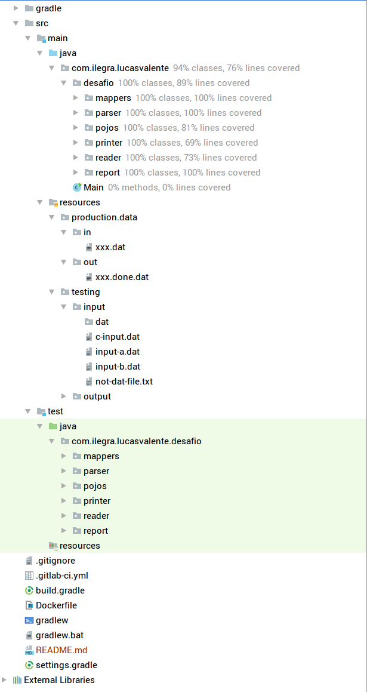

# File Processor

## Useful commands

| Description | Command |
| :--- | :--- |
| Generate the app jar | `docker run --rm -v "$PWD":/app -w /app gradle:4.6.0-jdk9 gradle jar` |
| Run the app jar | `docker run --rm -v "$PWD":/app -w /app openjdk:9.0-slim java -jar build/libs/lucasvalente-0.1.0.jar` |

## Test report

## Test coverage

